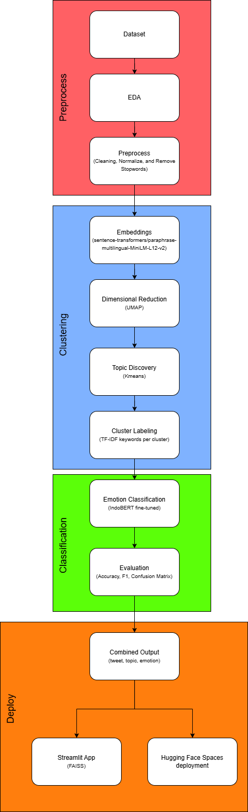

# Indonesian Tweet Emotion Analyzer with Aspect Discovery

[](https://www.python.org/)
[](https://huggingface.co/spaces/Nadaa9/nolimit-ds-test-nadafirdaus)
[](https://huggingface.co/Nadaa9/indobert-emotion-twitter)
[](https://github.com/facebookresearch/faiss)

## Live Demo

https://huggingface.co/spaces/Nadaa9/nolimit-ds-test-nadafirdaus

---

## Project Overview

This project builds an end-to-end NLP pipeline for emotion classification with automatic topic discovery on Indonesian Twitter data, submitted as part of the NoLimit Indonesia Data Scientist hiring test.

The pipeline detects five emotions — anger, fear, happy, love, and sadness — from Indonesian tweets, while simultaneously discovering latent topics through embedding-based clustering. The result is a combined output that maps each tweet to both a topic cluster and a predicted emotion, mimicking real-world social media monitoring workflows.

---

## Pipeline Flowchart



---

## Dataset

The dataset used is the Indonesian Twitter Emotion Dataset (EmoT), originally published by meisaputri21 and available on Kaggle.

Source: https://www.kaggle.com/datasets/wahyuikbalmaulana/indonesian-twitter-emotion-dataset

Original repository: https://github.com/meisaputri21/Indonesian-Twitter-Emotion-Dataset

The dataset contains 4,403 Indonesian tweets labeled across five emotion classes: anger, fear, happy, love, and sadness. After deduplication, 4,389 tweets were used for training and evaluation. The dataset is free for research use.

---

## Models

| Component | Model |
| --------- | ----- |
| Emotion Classifier | [Nadaa9/indobert-emotion-twitter](https://huggingface.co/Nadaa9/indobert-emotion-twitter) |
| Sentence Embeddings | sentence-transformers/paraphrase-multilingual-MiniLM-L12-v2 |

---

## Results

### Emotion Classification

| Emotion | Precision | Recall | F1 |
| ------- | --------- | ------ | -- |
| anger | 0.70 | 0.74 | 0.72 |
| fear | 0.67 | 0.75 | 0.71 |
| happy | 0.83 | 0.70 | 0.76 |
| love | 0.79 | 0.84 | 0.82 |
| sadness | 0.61 | 0.60 | 0.61 |
| **overall** | **0.72** | **0.72** | **0.72** |

Overall accuracy: 71%

### Topic Clusters Discovered

| Cluster | Topic | Size |
| ------- | ----- | ---- |
| 0 | Politik & Sosial | 907 |
| 1 | Cinta & Romansa | 570 |
| 2 | Doa & Harapan | 764 |
| 3 | Kehidupan Sehari-hari | 1,329 |
| 4 | Kegelisahan & Refleksi | 819 |

---

## Technologies Used

| Category | Technology |
| -------- | ---------- |
| Language Model | IndoBERT (indobenchmark/indobert-base-p1) |
| Sentence Embeddings | paraphrase-multilingual-MiniLM-L12-v2 |
| Vector Search | FAISS |
| Clustering | KMeans + UMAP |
| Indonesian NLP | PySastrawi |
| Dashboard | Streamlit |
| Deployment | Hugging Face Spaces (Docker) |
| Data Processing | Pandas, NumPy, Scikit-learn |

---

## Project Structure

```text
NOLIMIT-DS-TEST-NADAFIRDAUS/

├── app/
│   ├── pages/
│   │   ├── 1_Prediction.py
│   │   └── 2_Analytics.py
│   ├── utils/
│   │   └── loader.py
│   └── app.py
│
├── src/
│   ├── preprocessing.py
│   ├── embeddings.py
│   ├── clustering.py
│   └── classifier.py
│
├── data/
│   ├── kamus_singkatan.csv
│   └── sample.csv
│
├── artifacts/
│   └── predictions.csv
│
├── notebook.ipynb
├── pipeline.py
├── Dockerfile
├── config.yaml
├── flowchart.png
├── requirements.txt
├── .gitignore
└── README.md
```

---

## Installation

Clone the repository:

```bash
git clone https://github.com/Nadeeu/nolimit-ds-test-nadafirdaus.git
```

Move into the project directory:

```bash
cd nolimit-ds-test-nadafirdaus
```

Install required libraries:

```bash
pip install -r requirements.txt
```

Download the dataset from Kaggle and place it inside `data/`:

```text
data/Twitter_Emotion_Dataset.csv
```

Run the full pipeline:

```bash
python pipeline.py
```

Run the Streamlit app:

```bash
streamlit run app/app.py
```

Run with Docker:

```bash
docker build -t emotion-analyzer .
docker run -p 7860:7860 emotion-analyzer
```

---

## App Features

### Prediction Page

* Single tweet input with emotion prediction and confidence score
* Topic cluster assignment using FAISS nearest neighbor search
* Emotion probability distribution chart
* Batch CSV upload with downloadable results

### Analytics Page

* Emotion and topic distribution charts
* Emotion per topic heatmap
* True vs predicted emotion comparison
* Sample tweets per emotion

---

## License

This project is licensed under the MIT License.

The dataset is sourced from [meisaputri21/Indonesian-Twitter-Emotion-Dataset](https://github.com/meisaputri21/Indonesian-Twitter-Emotion-Dataset) and is free for research use.

---
## Developed By

**Nada Firdaus**

GitHub: https://github.com/Nadeeu

Hugging Face: https://huggingface.co/Nadaa9